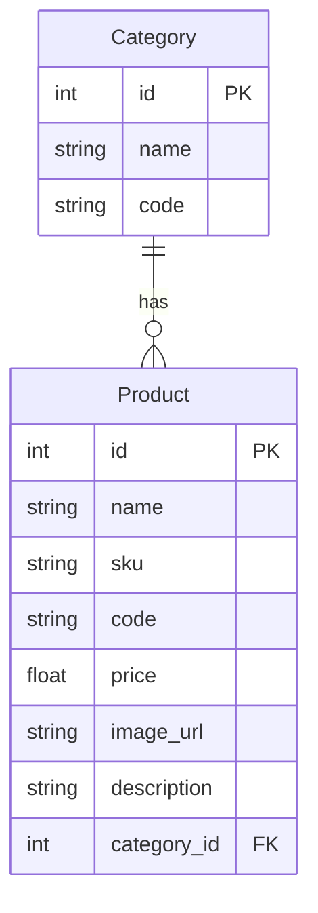

# product-service

##ERD

```mermaid
 erDiagram
    Product {
        int id PK
        string name
        string sku
        string code
        float price
         string image_url
        string description
        int category_id FK
    }
        Category {
        int id PK
        string name
        string code
    }

 Category ||--o{ Product : "has"
```
    
